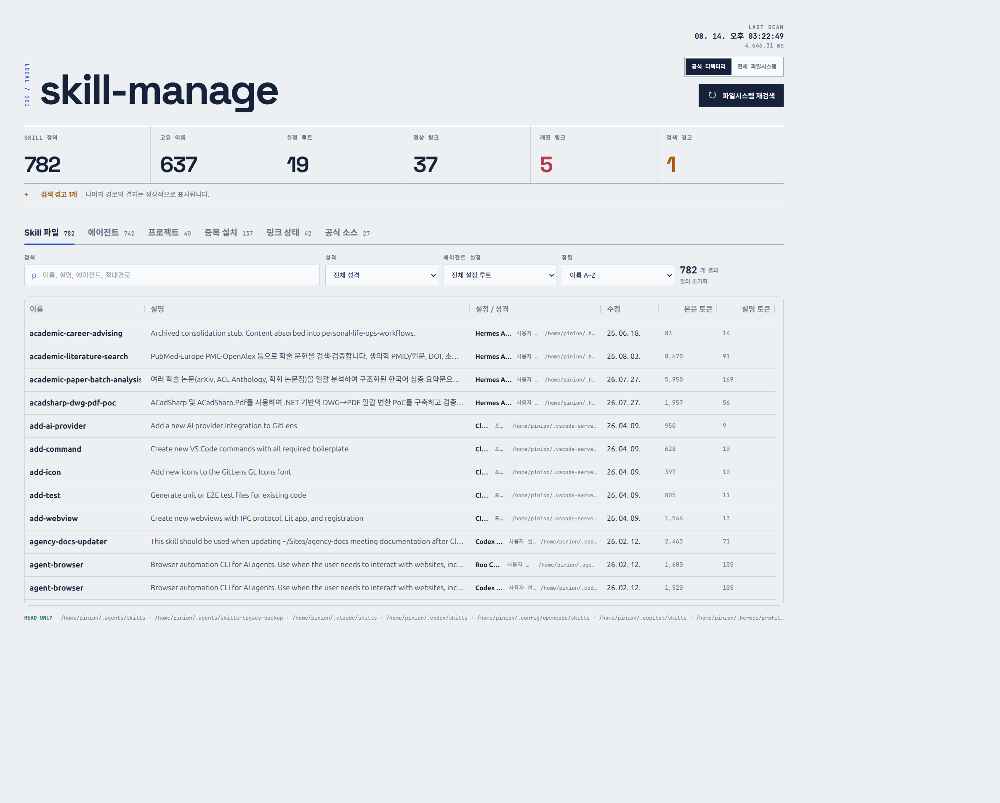
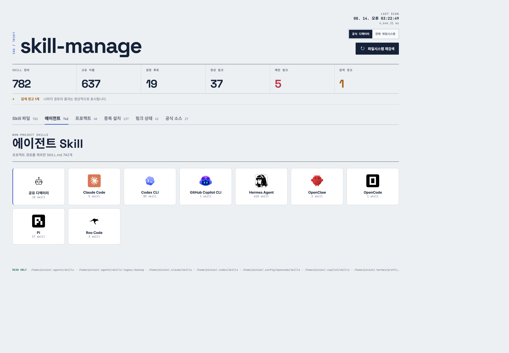

<div align="center">

# skill-manage

**로컬 코딩 에이전트 스킬 인벤토리**

모든 코딩 에이전트의 SKILL.md를 한곳에서 검색·탐색·관리하세요.

[](https://www.npmjs.com/package/skill-manage)
[](https://opensource.org/licenses/MIT)
[](https://nodejs.org)

</div>

---

## 왜 필요한가요?

Claude Code, Codex, Cursor, Hermes, Copilot... 각 에이전트마다 skill을 설치하고 관리합니다. 어디에 뭐가 있는지, 중복 설치된 건 없는지, 깨진 링크는 없는지 — 파일시스템을 뒤져야만 알 수 있었죠.

**skill-manage**는 파일시스템을 직접 스캔해서 모든 스킬을 하나의 대시보드로 보여줍니다.

## 한 줄 실행

```bash
npx skill-manage
```

끝입니다. 브라우저가 열리고 대시보드가 나타납니다.

---

## 둘러보기

<table>
  <tr>
    <td width="50%" align="center"><b>메인 대시보드</b></td>
    <td width="50%" align="center"><b>에이전트 카드</b></td>
  </tr>
  <tr>
    <td></td>
    <td></td>
  </tr>
</table>

### 🔍 전체 스킬 검색

이름·설명·에이전트·경로로 즉시 검색하고 필터링합니다. 토큰 수까지 한눈에.

### 🤖 에이전트별 스킬

로고 카드를 클릭하면 해당 에이전트의 스킬 테이블이 펼쳐집니다. 27개 에이전트를 지원합니다.

### 📁 프로젝트별 스킬

프로젝트 디렉터리 기준으로 스킬을 분류합니다. 어떤 프로젝트에 어떤 스킬이 있는지 즉시 확인.

### ⚠️ 중복 설치 감지

같은 이름의 스킬이 여러 위치에 설치되어 있으면 알려줍니다.

### 🔗 링크 상태 점검

심볼릭 링크가 깨졌는지, 올바른 대상을 가리키고 있는지 확인합니다.

### 📊 실시간 스캔 진행률

스캔 중 디렉터리 수, 발견된 스킬 수, 경과 시간을 실시간으로 표시합니다.

---

## 지원 에이전트

<div align="center">

| | | | | |
|:---:|:---:|:---:|:---:|:---:|
| Claude Code | Codex CLI | Cursor | Hermes | GitHub Copilot |
| Gemini CLI | OpenCode | Qwen Code | Roo Code | Kilo Code |
| Amp | Goose | Warp | Cline | Kiro |
| Antigravity | Pi | Codex | OpenClaw | Kimi Code |
| Mux | Crush | Grok Build | Jcode | MiMo Code |
| Factory Droid | Sakana Fugu | Zed | ... | **+ more** |

</div>

---

## CLI 옵션

```bash
npx skill-manage [옵션]
```

| 옵션 | 설명 |
| --- | --- |
| `--port <번호>` | 포트 지정 (기본: 자동 선택) |
| `--no-open` | 브라우저 자동 열지 않기 |
| `-h`, `--help` | 도움말 |
| `-v`, `--version` | 버전 |

```bash
# 포트 지정 + 브라우저 미실행
npx skill-manage --port 4400 --no-open
```

---

## 두 가지 검색 범위

### 공식 디렉터리 (기본)

각 에이전트의 공식 문서에 명시된 경로만 스캔합니다. 빠르고 정확합니다.

### 전체 파일시스템

홈 디렉터리 전체를 뒤져 숨겨진 스킬까지 찾아냅니다. 시간은 더 걸리지만 놓치는 게 없습니다.

---

## 안전한 읽기 전용

- 파일을 **생성·수정·삭제하지 않습니다**
- localhost에서만 동작합니다
- 파일 핸들은 심볼릭 링크를 따르지 않습니다
- Markdown 렌더링은 서버에서 sanitize 처리됩니다

---

## 로컬 개발

```bash
git clone https://github.com/pinion05/skill-manage.git
cd skill-manage
npm install
npm run dev
```

<div align="center">

---

MIT License · [GitHub](https://github.com/pinion05/skill-manage) · [npm](https://www.npmjs.com/package/skill-manage)

</div>
